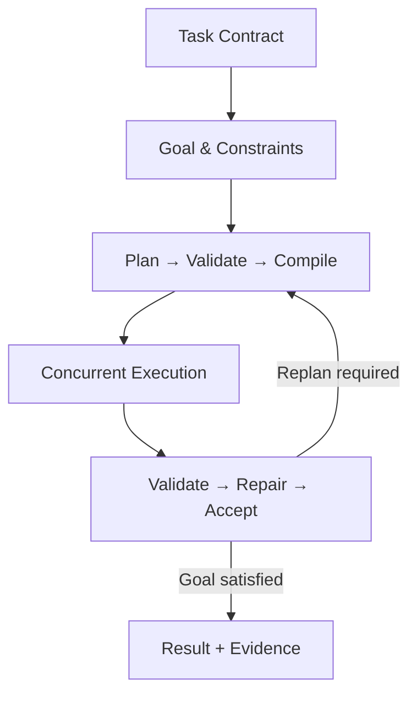
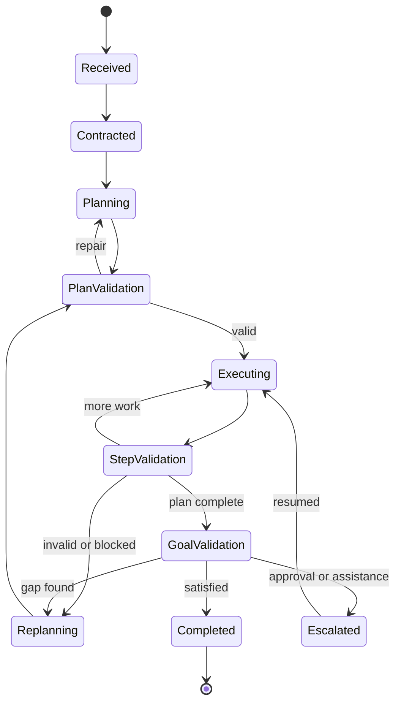

# Future-surviving agent standard

An agent is not an LLM with tools and a ReAct loop.

It is a **durable, contract-driven, independently deployable goal processor**:

> Understand → contract the goal → plan → validate the plan → schedule work → execute safely → validate evidence → repair/replan → complete or escalate.

Design rule:

> **Deterministic control shell; agentic intelligence inside controlled decision points.**

Planning and reasoning may be probabilistic. State transitions, permissions, retries, budgets, evidence, acceptance, and side effects must be deterministic.

ReAct may exist inside an execution node for bounded exploration. It is not the agent architecture.

The reusable abstraction:

```text
Agent =
  Identity
  + Capability Contract
  + Goal Contract
  + Immutable RuntimeBundle
  + Durable State Machine
  + Context Compiler
  + Planner
  + Concurrent Scheduler
  + Controlled Executor
  + Independent Validators
  + Replanner
  + Governed Memory
  + Evidence Ledger
  + Delegated Authority
  + Protocol / Provider Adapters
  + Policy, Budget, Evaluation, Release, Degradation
```

Canonical types live in [`agent_kernel`](../agent_kernel). Domain agents live in [`agents/<agent_id>/`](../agents). Do not make MCP, A2A, AGNTCY, LangGraph, or a vendor SDK the internal domain model — adapt them at the edge.

## 1. North-star control flow



### Layers the agent owns

| Layer | Responsibility |
| --- | --- |
| Agent interface | Manifest, identity, version, capabilities, task/result schemas |
| Intake | Normalize input, validate schema, reject unsupported work |
| Goal manager | Measurable goal, constraints, acceptance criteria |
| Context compiler | Retrieve, rank, budget, and policy-check context |
| Planner | Dependency-aware, budgeted DAG |
| Plan validator | Feasibility, completeness, safety, goal coverage |
| Plan compiler | Abstract plan → executable task DAG |
| Scheduler | Bounded parallelism, leases, isolated result envelopes |
| Executor | Tools, models, code, subagents through sandboxed gateways |
| Step validator | Result vs task contract (not the executor scoring itself) |
| Goal evaluator | Did the **goal** pass, not merely the plan |
| Repair/replanner | Retry, repair, replace strategy, replan, escalate |
| State manager | Checkpoints after every meaningful transition |
| Evidence manager | Claims, sources, artifacts, receipts, validation |
| Memory manager | Working, episodic, semantic, procedural, artifact, ledger |
| Policy/budget manager | Permissions, cost, time, tool, token, risk |
| Observability | Events, traces, metrics, logs, replay |
| Evolution envelope | Runtime freeze, evals, release, migration, degradation |

### The Agent OS/kernel owns

Authentication, tenant isolation, global authorization, secrets, cross-agent scheduling and quotas, global concurrency, immutable event ledger, shared memory governance, tool sandboxing, human approval routing, final mission acceptance.

Agents are autonomous **within a contract**, governed workers **on the platform**.

Standalone means executable as: task API, LangGraph subgraph, supervisor worker, child agent, queue/scheduled job, local test with mocked gateways. It does not mean privately reimplementing platform concerns.

## 2. Lifecycle state machine

Do not implement `while not done`. Persist a checkpoint after every meaningful transition. Production persistence is durable, not in-memory.



Allowed transitions are encoded in `agent_kernel.lifecycle`. Illegal transitions are bugs.

Terminal outcomes (never coerce uncertainty into success):

```text
Succeeded
SucceededWithWarnings
PartiallySucceeded
Blocked
ApprovalRequired
BudgetExhausted
DeadlineExceeded
PolicyDenied
Cancelled
FailedRecoverably
FailedPermanently
```

## 3. Required contracts

Every invocation uses an immutable `AgentTaskContract`, not a raw prompt. Every result is an `AgentResult`. A successful tool call is not successful agent execution. Success is **goal acceptance**.

See YAML shapes in `agent_kernel/contracts`. Required plan validator checks:

- Every success criterion is covered.
- Dependencies are a valid DAG.
- Inputs exist or can be produced.
- Tools/agents are available.
- Side effects have approval and compensation.
- Cost/time fit budget.
- Tasks are bounded; every meaningful output has a validator.
- Independent branches are identified for concurrency.
- Failure and fallback paths exist.

## 4. Concurrency

Concurrency is at the **task-DAG** level. Workers lease tasks. Isolated result envelopes. Only a reducer updates shared plan state. Bounded fan-out. Cancellation propagates. Replanning reuses validated branches whose assumptions still hold.

Protect against: duplicate execution, lost leases, stale writes, circular delegation, ping-pong, recursive spawn, deadlock, livelock replanning, conflicting artifact writes, validator–executor collusion, budget multiplication, late overwrites.

## 5. Four validation levels

| Level | Question |
| --- | --- |
| Input | Valid, safe, supported, specified? |
| Plan | Can this satisfy the goal within constraints? |
| Step | Promised result with evidence? |
| Goal | Every acceptance criterion actually met? |

Executor is never the sole authority on its own output. Separate producer and validator for high-value decisions. LLM-as-judge only where deterministic validation is impossible.

## 6. Memory

Never one undifferentiated store. Writes need validation, provenance, tenant, sensitivity, expiry. Hypotheses must not silently become semantic truth.

| Memory | Lifetime |
| --- | --- |
| Working | One execution |
| Episodic | Retention-controlled |
| Semantic | Cross-run, validated facts only |
| Procedural | Versioned playbooks |
| Artifact | Durable outputs |
| Evidence ledger | Audit lifetime, immutable |

## 7. Evolution envelope (the rest of the standard)

- **Immutable RuntimeBundle** per run: agent/graph/contract versions, model profiles, prompt hashes, tool registry, policies, container digest. Existing runs resume on the frozen bundle or an explicit migration.
- **Canonical internal protocol** + adapters (REST, gRPC, queue, LangGraph, MCP, A2A, AGNTCY, local).
- **Capability-based model selection**, not `ModelProvider.generate()` around a brand name.
- **Context compiler** as a subsystem (budgets, provenance, injection detection, trusted vs untrusted).
- **Delegated authority chain**: user → mission → agent → task → tool. Short-lived, scope-bound credentials.
- **Tool supply-chain**: digest, schemas, side-effect class, SBOM, sandbox, revocation. Never trust a tool description because a server sent it.
- **Failure taxonomy** with per-class retry/compensation/escalation — not one retry loop.
- **Evaluation OS** and **signed releases** (shadow, canary, rollback). Average quality gains that worsen security, cost, or a critical scenario fail the release.
- **Controlled self-improvement**: propose in sandbox; never mutate production identity, grants, audit evidence, or trusted memory.
- **Hierarchical budgets** and SLOs. Cheapest **qualified** model, not always the strongest.
- **Contract migration**: schema name, semver, upcast/downcast, replay, unknown-field policy.
- **Graceful degradation** when models, validators, queues, or humans fail.

## 8. Package layout

Every agent written into `/agents` uses this tree. Domain modules may add files; they may not omit required ones.

```text
agents/<agent_id>/
├── manifest.yaml
├── README.md
├── contracts/
├── graph/
├── nodes/
├── capabilities/ports/
├── capabilities/adapters/
├── validators/
├── policies/
├── prompts/
├── memory/
├── evidence/
├── telemetry/
├── evolution/
└── tests/
    ├── unit/
    ├── component/
    ├── contract/
    ├── replay/
    ├── recovery/
    ├── concurrency/
    ├── adversarial/
    └── evaluations/
```

`agent_id` is snake_case (`security_analysis`, `prompts_specialist`).

## 9. What promptsSpecialist must produce

Executing `prompts/promptsSpecialist` writes a **package**, not a markdown persona:

```text
agents/<agent_id>/
```

The specialist fills domain contracts, goal/acceptance, validators, policies, prompts, and capability ports. It imports the kernel; it does not fork a new lifecycle or invent a second task protocol.

## 10. Instance model

```python
await AgentType(ports=...).spawn().execute(task)
# 100 concurrent runs = 100 spawn() instances
```

Engineering rules (SOLID ports, functional nodes, typed failures): [`engineering.md`](engineering.md).  
Coverage (0% gaps vs this spec): [`coverage.md`](coverage.md).
